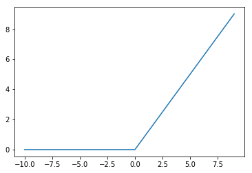
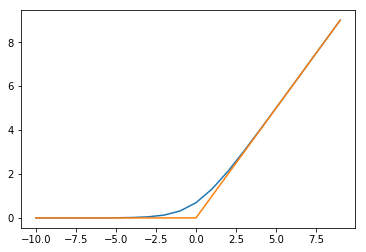

# Where Comes The Name "Softmax"?
# Softmax的名字是怎么来的？

When I was learning multiclass classifiers such as SVM and Neural Networks, "Softmax" came across to my mind with some mystery in its name. I was wondering why it was named so, and whether there was "Hardmax" function being its brother or even ancestor. I checked it out on Wikipedia but failed to find any useful information there (https://en.wikipedia.org/wiki/Softmax_function). There was the same question about Softmax's name on Quora and one of the answers, to my memory, revealed some part of the mystery. However, I cannot find that Quora link anymore.

Like most people, I continue to use it natually in my work without thinking about its origin. Engineers and researchers are mostly pragmatic, aren't they?

But recently when I was preparing for a few job interviews and Softmax drew my attention again (because I was afraid that an interviewer would ask me to explain Softmax function or Softmax classifier in details). I decided to figure out why it's got this funny name and whether it really stems from another related function nick-named "Hardmax" (or not, no chance to find it on Wikipedia, anyway).

## Hardmax
Before elaborating Softmax, I just jump to the conclusion that there **is** "Hardmax" function, which is usually called **Hinge Loss** function used in linear classifiers such as SVM:

$$ L_{i}= \sum_{j≠i}max(0,s_{j} − s_{i} + Δ) $$ 

where $s_{j}$ and $s_{i}$ are classification scores of the _j-th_ and _i-th_ element of the output vector of the model. And $L_{i}$ is the loss for classifying the input $x_{i}$ as the _i-th_ class.

Stanford CS class CS231n: Convolutional Neural Networks for Visual Recognition has a very good explanation of the above loss function. Please check it out here http://cs231n.github.io/linear-classify/#softmax.

And here is an example from it: ![http://cs231n.github.io/assets/imagemap.jpg]

Wikipedia has Hinge Loss as well https://en.wikipedia.org/wiki/Hinge_loss.

Basically, hinge loss has a threshold $\Delta$ below which the loss is perceived as zero. The threshold $\Delta$, which functions as a margin between the classification boundary (a.k.a. decision boundary) and the nearest samples, is applied to $s_{j}$ for all $j≠i$ so that the loss of $s_{j}$ is added up to the overall loss of $s_{i}$ only when $s_{j}$ has a difference from $s_{i}$ smaller than the threshold.

Thus the hinge loss function has the form of max function $max(0, x)$ and it is the threshold that makes the max "hard". We'll see this later on when we draw the graph of max function. Now here is an example of how hinge loss is calculated (from Stanford CS231n), in which $i=0$, i.e., the ground truth label of the input pitcure is "cat", and $\Delta = 10$:

$$ L_{i}=max(0,437.9-(-96.8)+10) + max(0,61.95−(-96.8)+10)$$

Then we want to see how max function looks like if we draw a graph of it. I simplify the graph by using only integers for $s_{j}$ while fixing $s_{i}$ to 0 and $\Delta = 0$.


```python
import random
import numpy as np
from matplotlib import pyplot

def max_x(x, delta=0.):
    """ Returns the list of positive real numbers x whose negative items are turned into 0. """
    x = np.array(x)
    negative_idx = x < delta
    x[negative_idx] = 0.
    return x
```


```python
x = np.array(range(-10, 10))
s_j = np.array(x)

hinge_loss = max_x(s_j, delta=1.)

pyplot.plot(s_j, hinge_loss)
pyplot.show()
```





No doubt why $max$ function is also called "hinge" function, because its shape looks like a hinge. It can be called "hardmax" because the loss introduced by $s_{j}$ to $L_{i}$ is zeroed out as long as its negative difference from $s_{i}$ is larger than a threshold regardless of its own value. Or, from another perspective, there is a point (at $s_{j}=0$ in the graph) where the $max$ function is not differentiable (which is 'hard' as compared to 'soft').

## Softmax 

### Interpretation of Scores
Let's put hinge/hardmax function aside for a while and talk about Softmax function. Again, Stanford CS231n provides very clear description of why Softmax function is applied to classification scores, quoted below:

_Unlike the SVM which treats the outputs $f(x_{i},W)$ as (uncalibrated and possibly difficult to interpret) scores for each class, the Softmax classifier gives a slightly more intuitive output (normalized class probabilities) and also has a probabilistic interpretation that we will describe shortly. In the Softmax classifier, the function mapping_

$s_{i} = f(x_{i};W)=W x_{i}$

_stays unchanged, but we now interpret these scores as the **unnormalized log probabilities** for each class and replace the hinge loss with a cross-entropy loss that has the form:_

$$ L_{i} = −log \frac{e^{s_{i}}}{\sum_k{e^{s_{k}}}}$$


_The function_

$$ f_{i}(z) = \frac{e^{s_{i}}}{\sum_k{e^{s_{k}}}}$$ 

_where_ $$ z = (s_{0}, s_{1}, ..., s_{K})$$

_is called the **softmax function**: It takes a vector of arbitrary real-valued scores (in $z$) and squashes it to a vector of values between zero and one that sum to one._

### Cross-Entropy Loss
Attention should be paid to the final form of $L_{i}$ just above, in which it is not obvious where cross-entropy loss is applied. Let's delve into more details.

As said above, score $s_{i}$ is interpreted as unnormalized log probability for class $i$, so we have:

$$ s_{i} = log \overline{P}(y=i)$$

Or

$$ \overline{P}(y=i) = e^{s_{i}}$$

Now we normalize this probability:

$$ P(y=i) = \frac{e^{s_{i}}}{\sum_k{e^{s_{k}}}}$$

This is Softmax function. Then we calculate cross-entropy, quote from Stanford CS231n:

_The **cross-entropy** between a “true” distribution p and an estimated distribution q is defined as:_

$$ H(p,q)=−\sum_{x}p(x)logq(x)$$ 

_The Softmax classifier is hence minimizing the cross-entropy between the estimated class probabilities ( $q(s_{i})=\frac{e^{s_{i}}}{\sum_{k}e^{s_{k}}}$ as seen above) and the “true” distribution, which in this interpretation is the distribution where all probability mass is on the correct class (i.e. $p=[0,…1,…,0]$ contains a single 1 at the i-th position). _

In a nutshell, cross-entropy measures the difference between two vectors. In our case, we want to compare the ground-truth label that has been one-hot coded to $p = [0, ..., 1, ..., 0]$ with the output vector of the model $q(s_{i})$. As vector $p$ has 1 at the _i-th_ position and 0's at all the other positions, the result of cross-entropy between vector $p$ and vector $q$ keeps only the _i-th_ element of $q$ vector.

$$ H(p, q) = - log q_{i} = -log\frac{e^{s_{i}}}{\sum_k{e^{s_{k}}}}$$

This is exactly $L_{i}$. It is the negative log of Softmax function.


### Softmax Function

Let's re-write entropy-loss over Softmax function as below so that it makes it clear that the loss function is in fact a function of score difference:

$$ f(s_{k}, s_{i}) = -log \frac{e^{s_{i}}}{{\sum_{k=1}^{K}e^{s_{k}}}} = -log \frac{1}{{\sum_{k=1}^{K}e^{s_{k}-s_{i}}}} = -log \frac{1}{1+{\sum_{k≠i}^{K}e^{s_{k}-s_{i}}}}$$ 

Unlike in hinge loss, every element $k$ of the output score vector has some influence to the final loss regardless of its score value $s_{k}$. So we take one of the element's score $s_{k}$ as variate with $s_{i}$ fixed:

$$ f(s_{k}) =  -log {\frac{1}{({1+e^{s_{k}-s_{i}}})}}$$

K is the maximum number of classes.

Now let's draw the graph of $ f(s_{k})$. As we are only interested in the shape of $f(s_{k})$, we can fix $s_{i}$ to 0 as we did when drawing the graph of $max$ function.

For comparison, I draw both the $max$ function together with $Softmax$ function.


```python
def cross_entropy(s_k, s_j):
    soft_max = 1/(1+np.exp(s_k - s_j))
    cross_entropy_loss = -np.log(soft_max)
    return cross_entropy_loss
```


```python
s_i = 0
s_k = np.array(range(-10, 10))

soft_x = cross_entropy(s_k, s_i)

pyplot.plot(range(-10, 10), soft_x)
pyplot.plot(x, hinge_loss)
pyplot.show()
```





Can you tell why $Softmax$ is a 'soft' version of $max$ function? I believe you can now.


```python

```
